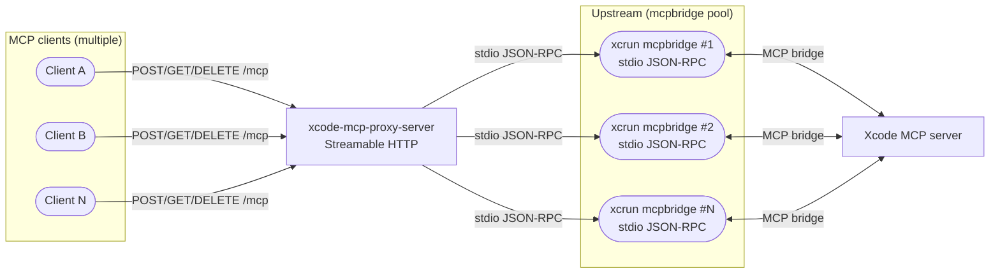
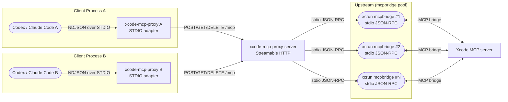

# XcodeMCPProxy Architecture

## Summary
- `xcode-mcp-proxy-server` runs as the proxy server (Streamable HTTP; spawns `xcrun mcpbridge`).
- HTTP-capable MCP clients connect directly to the proxy server (default: `http://localhost:8765/mcp`).
- `xcode-mcp-proxy` remains as a supported STDIO compatibility adapter, forwarding to the proxy server as a modern Streamable HTTP client.
- The proxy targets MCP protocol version `2025-06-18`, matching current Xcode `mcpbridge` negotiation.
- Each HTTP request carries exactly one JSON-RPC object. JSON-RPC batch arrays are rejected at the HTTP boundary without downstream side effects.

## Diagrams

### Proxy Server (Streamable HTTP)

### STDIO Adapter (Optional)

## Ports and Addressing
- `xcode-mcp-proxy-server` binds to `localhost:8765` by default (override via `--listen` / `--host` / `--port`, or env `LISTEN` / `HOST` / `PORT`).
- The proxy server writes the resolved endpoint to `~/Library/Caches/XcodeMCPProxy/endpoint.json`.
- `xcode-mcp-proxy` (STDIO adapter) resolves the upstream in this order:
  - explicit URL/config, such as CLI `--url`
  - `XCODE_MCP_PROXY_ENDPOINT`
  - discovery file (`~/Library/Caches/XcodeMCPProxy/endpoint.json`)
  - fallback default (`http://localhost:8765/mcp`)

## Streamable HTTP Contract
- Every request is checked by one Origin policy before route resolution, session creation, debug reset, or upstream I/O. This includes `/health`, `/debug/*`, MCP routes, and unknown routes.
- A missing `Origin` header is allowed for non-browser clients. When `Origin` is present it must be one valid HTTP(S) origin whose host and port match the actual listener policy; empty, multiple, `null`, malformed, and cross-origin values return `403`.
- `POST /mcp` requires `Content-Type: application/json` and `Accept` containing both `application/json` and `text/event-stream`.
- The server generates `MCP-Session-Id` on `initialize`; caller-provided session ids are ignored for initialize.
- After initialize, `POST`, `GET`, and `DELETE` require `MCP-Session-Id`. An explicit `MCP-Protocol-Version` must be valid, supported, and match the negotiated version.
- When `MCP-Protocol-Version` is omitted, the server uses the session's negotiated version. If no negotiated version exists, it evaluates the protocol-defined fallback `2025-03-26` and returns `400` when that version is unsupported.
- Missing session ids return `400`; unknown or terminated session ids return `404`.
- `DELETE /mcp` terminates the session; later requests with that session id return `404`.
- A client transport session with no in-flight HTTP request and no open SSE stream is retained for five minutes after its last client activity so that an interrupted SSE connection can reconnect. A one-minute sweep then terminates stale sessions and their buffered notifications; outbound server notifications do not extend this lifetime. Runtime-internal control-plane and health-probe sessions do not participate in transport expiry.
- Empty, singleton, and mixed JSON-RPC arrays return `400`; the internal executor and response router operate on typed single messages. An array response from an upstream is a protocol violation.
- Upstream `notifications/progress` is delivered only to the session that owns the active operation lease. It is dropped when no owner exists; globally scoped server notifications continue to fan out to initialized sessions.
- HTTP owns each session's bounded SSE notification buffer. On overflow it drops the oldest notification and emits at most one warning per 30 seconds per session. `dropped_notifications` is cumulative for that session, while the warning also reports the dropped delta and sanitized methods of the notifications actually evicted; notification payloads are never logged. Unhandled server notifications remain debug-level events.

## Discovery Contract

- The discovery record is a URL hint, not proof that a server is reachable. PID liveness is not used as a second source of truth.
- Reachability is established only by connecting to the endpoint and completing the standard initialize handshake.
- When discovery is enabled, writing the record is part of server startup. A write failure unwinds listener/runtime resources and makes startup fail.

## Xcode Process Observation Contract

- The proxy observes `NSWorkspace.runningApplications` with KVO using an initial callback. Every callback reads the current atomic property once instead of treating the KVO change payload as a full snapshot. This is the only live process-inventory owner.
- Process-bound routing, upstream readiness, DocumentationSearch discovery, startup summaries, and permission-dialog automation read the same cached snapshot. Permission automation covers the known helper applications exposed by `NSWorkspace`; it does not claim an inventory of every OS process.
- The runtime does not run `pgrep`, enumerate all PIDs, or periodically rescan Xcode membership. Inventory membership changes only from the initial/KVO snapshots. Recovery may re-run route reconciliation against the monitor's cached snapshot, but it never re-reads OS process inventory.
- Every compatible Xcode PID in the cached inventory owns an independent route. As soon as membership is established, the runtime starts the route's primary bridge and sends that route's protocol `initialize` without waiting for another Xcode's response, permission decision, initialized notification, or catalog. `CanonicalHandshakeState` accepts concurrent proof-bound participants; the first participant to complete its initialized-notification and health commit publishes the canonical semantic result, and results that differ only in `serverInfo` join it. Each joined route loads its own catalog, after which workspace and tab ownership select the matching PID. A meaningful result mismatch terminates the current activation attempt for that route; the route may retry after its cooldown and must pass compatibility again.
- Canonical initialize support is bound to the exact upstream topology proof, including slot generation. Raw compatible initialize evidence is retained separately from current health eligibility. When the publishing proof is quarantined or exits, the exposed source and raw result rebind to an eligible compatible survivor. If every raw supporter is quarantined, the initialize result is hidden from clients while the retained semantic baseline still rejects incompatible offers. Only a validated health probe or validated `tools/list` response restores eligibility; ordinary request success does not. Detaching the last raw supporter clears the semantic baseline, and a delayed clear from an old slot generation cannot remove its replacement.
- Quarantine, detach, and slot replacement evict the catalog and abandon catalog-attempt resources owned by the affected exact proof. A recovered proof can re-expose its retained initialize result after validation, but it is not routable for tools until a fresh `tools/list` load commits a new catalog.
- If a downstream `initialize` is pending while only quarantined raw supporters remain, the initialize owner arms one generation-fenced timer for the earliest exact proof and quarantine deadline. The callback validates the topology proof, health-probe generation, deadline, and pending waiter before probing; failure re-arms from the current health state, while publication, removal of the last waiter, debug reset, and shutdown cancel the timer. This recovery reads existing topology and never rescans Xcode processes.
- Auto-approve still polls AX windows while enabled because AppKit has no permission-dialog appearance event. It reconciles cached process IDs and gives each Xcode/helper PID an independent AX polling task, so one process's AX response time cannot delay another process's displayed dialog. Child-process lookup is deferred until a structurally eligible permission dialog needs ownership validation.
- A route cooldown uses a `ProcessControlPlaneAuthority`-owned one-shot timer fenced by route identity, scope, monotonic generation, and deadline. Replacement, availability, expiry, retirement, reset, and shutdown detach the exact owned handle; stale attachment and callback races cannot mutate a newer cooldown. Expiry retries the existing route without querying the OS process list.
- An unavailable DocumentationProvider attempt schedules exactly one generation-fenced retry after two seconds. The retry uses the cached Xcode snapshot and never queries the OS process inventory; success, replacement, reset, and shutdown cancel the pending work.
- Apple delivers `runningApplications` KVO changes while the main run loop runs in a common mode. The shipped Darwin async-main executable and normal AppKit hosts satisfy this; embedding hosts must use the public async lifecycle rather than block the main thread.
