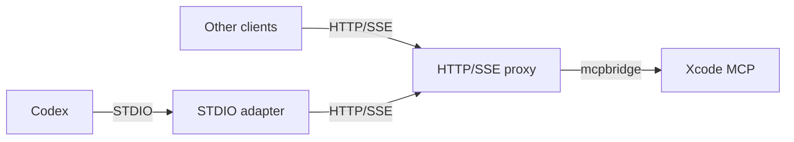

# Architecture

## Overview

XcodeMCPProxy consists of a few small components that are combined in different run modes:

- **STDIO adapter**: reads/writes JSON-RPC over STDIO and forwards requests to the HTTP/SSE proxy.
- **HTTP/SSE proxy**: multiplexes sessions and speaks Streamable MCP (HTTP + SSE).
- **mcpbridge**: the upstream Xcode MCP server process.

## Process Topology

## Run Modes

- **Integrated STDIO mode**  
  `xcode-mcp-proxy --stdio` runs the HTTP/SSE proxy and STDIO adapter in a single process.

- **Separate STDIO adapter**  
  `xcode-mcp-stdio-proxy --no-spawn-proxy --proxy-url http://127.0.0.1:8765/mcp`  
  Use this when the HTTP/SSE proxy is already running.

- **HTTP/SSE only**  
  `xcode-mcp-proxy --listen 127.0.0.1:8765`

## Sessions & Multiplexing

- Each client should use a unique `Mcp-Session-Id`.
- If `initialize` is sent without a session id, the proxy returns one in the response headers.
- For SSE, include `Mcp-Session-Id` on `GET /mcp`.

STDIO is single-client per process; multi-client support is provided by the HTTP/SSE proxy.
