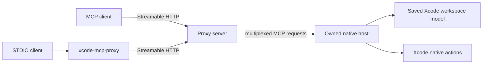

# XcodeMCPProxy architecture

`xcode-mcp-proxy-server` serves MCP over Streamable HTTP and starts one packaged
native helper for the selected Xcode installation. The helper loads Xcode
frameworks through ABIBridge and executes the enabled headless actions.

## Request routing

```mermaid
flowchart LR
  client["MCP client"] -->|"Streamable HTTP"| proxy["Proxy server"]
  stdio["STDIO client"] --> adapter["xcode-mcp-proxy"]
  adapter -->|"Streamable HTTP"| proxy
  proxy -->|"multiplexed MCP requests"| host["Owned native host"]
  host --> model["Saved Xcode workspace model"]
  host --> actions["Xcode native actions"]
```

An absolute `workspaceIdentifier` loads a model through the native registry when
needed. The proxy forwards workspace arguments to that host. Workspace state,
scheme selection, and native operation sessions belong to the host, independently
of any open Xcode application. File tools use saved disk content.

## Catalog ownership

`ToolsCatalogAuthority` keeps the catalog tied to the native connection and
refresh that supplied it. `ControlPlaneCoordinator` shares concurrent refresh
work while keeping caller deadlines and cancellation independent. Topology and
catalog leases prevent responses from an old connection from replacing the
current catalog. A tool call captures the provider definition for response
normalization, even if the catalog refreshes while the call is running.

The runtime owns request correlation, progress delivery, cancellation, and
connection recovery. Requests multiplex on the native connection. Cancellation
propagates to the matching native action task. Connection failure fails affected
requests; delivery-unknown mutations are not replayed. Replacement initialization
waits for the previous host to stop.

Shutdown first cancels shared catalog callers, then retires the host and drains
owned request and event tasks. The host closes workspace resources it owns.

## Ports and discovery

The server binds `localhost:8765` by default. `--listen`, `--host`, `--port`, and
`LISTEN` / `HOST` / `PORT` select another address. Endpoint discovery uses
`~/Library/Caches/XcodeMCPProxy/endpoint.json` unless overridden.

The STDIO adapter resolves explicit `--url`, `XCODE_MCP_PROXY_ENDPOINT`, the
discovery file, then `http://localhost:8765/mcp`. The Swift client's default
`.streamableHTTPProxyDiscovery()` reads the proxy discovery record and requires
a running server. Explicit standalone `.localBridge(.nativeHost(...))` starts
an owned headless host.

A discovery record is a URL hint. Only a connection and standard MCP initialize
handshake establish reachability. Discovery publication is part of server
startup; write failure unwinds acquired resources.

## Streamable HTTP Contract
- Every request is checked by one Origin policy before route resolution, session creation, debug reset, or upstream I/O. This includes `/health`, `/debug/*`, MCP routes, and unknown routes.
- A missing `Origin` header is allowed for non-browser clients. When `Origin` is present it must be one valid HTTP(S) origin whose host and port match the actual listener policy; empty, multiple, `null`, malformed, and cross-origin values return `403`.
- `POST /mcp` requires `Content-Type: application/json` and `Accept` containing both `application/json` and `text/event-stream`.
- The server generates `MCP-Session-Id` on `initialize`; caller-provided session ids are ignored for initialize.
- After initialize, `POST`, `GET`, and `DELETE` require `MCP-Session-Id`. An explicit `MCP-Protocol-Version` must be valid, supported, and match the negotiated version.
- When `MCP-Protocol-Version` is omitted, the server uses the session's negotiated version. If no negotiated version exists, it evaluates the protocol-defined fallback `2025-03-26` and returns `400` when that version is unsupported.
- Missing session ids return `400`; unknown or terminated session ids return `404`.
- `DELETE /mcp` terminates the session; later requests with that session id return `404`.
- A client transport session with no in-flight HTTP request and no open SSE stream is retained for five minutes after its last client activity so that an interrupted SSE connection can reconnect. A one-minute sweep then terminates stale sessions and their buffered notifications; outbound server notifications do not extend this lifetime. Runtime-internal control-plane and health-probe sessions do not participate in transport expiry.
- HTTP connection, SSE connection, request, and response access events are debug telemetry, including expected protocol-level `4xx` responses. The response remains the client-visible error contract.
- Empty, singleton, and mixed JSON-RPC arrays return `400`; the internal executor and response router operate on typed single messages. An array response from an upstream is a protocol violation.
- Upstream `notifications/progress` is delivered only to the session that owns the active operation lease. It is dropped when no owner exists; globally scoped server notifications continue to fan out to initialized sessions.
- HTTP owns each session's bounded SSE notification buffer. On overflow it drops the oldest notification and emits at most one warning per 30 seconds per session. `dropped_notifications` is cumulative for that session, while the warning also reports the dropped delta and sanitized methods of the notifications actually evicted; notification payloads are never logged. Unhandled server notifications remain debug-level events.

## Native helper

`NativeHostInvocation.resolve` locates `XcodeMCPNativeHost.app` beside the proxy
binary, through `XCODE_MCP_NATIVE_HOST_BUNDLE`, or through installation paths.
Explicit bundle and developer-directory URLs support embedding. Missing helper
or native contracts return diagnostics.

The helper owns its AppKit event loop, document controller, and native framework
lifetime. The proxy does not observe GUI processes or access Xcode's agent
permission store. The helper uses the public dynamic-loader entitlement needed
to load the selected Xcode's frameworks; it carries no copied Apple-restricted
entitlements. See [native host design](native-headless-backend.md).
