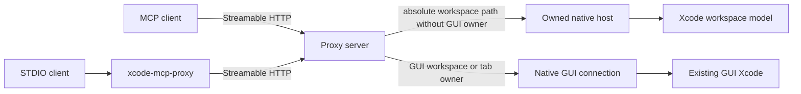

# XcodeMCPProxy architecture

`xcode-mcp-proxy-server` serves MCP over Streamable HTTP and starts the packaged
native helper. The helper loads Xcode frameworks through ABIBridge method
handles. One headless host provides the canonical native catalog and workspace
models; each GUI Xcode owner gets one native connection. Requests multiplex on
those connections instead of requiring a configurable process pool.

## Request routing

```mermaid
flowchart LR
  client["MCP client"] -->|"Streamable HTTP"| proxy["Proxy server"]
  stdio["STDIO client"] --> adapter["xcode-mcp-proxy"]
  adapter -->|"Streamable HTTP"| proxy
  proxy -->|"absolute workspace path without GUI owner"| host["Owned native host"]
  proxy -->|"GUI workspace or tab owner"| gui["Native GUI connection"]
  host --> model["Xcode workspace model"]
  gui --> app["Existing GUI Xcode"]
```

The runtime discovers GUI ownership through its cached Xcode inventory and
window identifiers. An absolute `workspaceIdentifier` selects its GUI owner
when one exists. Otherwise, the host loads the workspace model for the operation.
Opaque native workspace identifiers stay on the native host. Opaque GUI tab
identifiers select their known GUI owner. Symlinks are resolved when matching
workspace paths. Ambiguous GUI ownership requires an explicit tab selection;
a failed known owner is not replaced by another owner.

GUI builds use the active workspace scheme and save pending editor changes.
Native read/current-file results keep their disk-backed semantics. The runtime
does not promise that every tool exposes an unsaved GUI buffer.

## Catalog ownership

The owned native host must complete `tools/list` before the proxy exposes a
canonical catalog. A successful GUI catalog does not substitute for native host
failure. Concurrent client refreshes share their load and deadline ownership.
GUI catalog refreshes run in the background and provide routing metadata.
Catalog change notifications reflect a changed exposed tool surface.

The runtime owns request correlation, cancellation, and connection recovery.
Multiplexing preserves independent request IDs and progress lanes on each
connection. Cancellation ends only the matching request. A GUI action remains
tracked until its native reply or connection termination; shutdown cancels and
awaits producers and invalidates owned connections.

## Ports and discovery

The server binds `localhost:8765` by default. `--listen`, `--host`, `--port`, and
`LISTEN` / `HOST` / `PORT` select another address. Endpoint discovery uses
`~/Library/Caches/XcodeMCPProxy/endpoint.json` unless overridden.

The STDIO adapter resolves explicit `--url`, `XCODE_MCP_PROXY_ENDPOINT`, the
discovery file, then `http://localhost:8765/mcp`. The Swift client's default
`.streamableHTTPProxyDiscovery()` reads the proxy discovery record and requires
a running server. Explicit standalone `.localBridge(.nativeHost(...))` starts
an owned headless host.

A discovery record is a URL hint. Only a connection and standard MCP initialize
handshake establish reachability. Discovery publication is part of server
startup; write failure unwinds acquired resources.

## Streamable HTTP Contract
- Every request is checked by one Origin policy before route resolution, session creation, debug reset, or upstream I/O. This includes `/health`, `/debug/*`, MCP routes, and unknown routes.
- A missing `Origin` header is allowed for non-browser clients. When `Origin` is present it must be one valid HTTP(S) origin whose host and port match the actual listener policy; empty, multiple, `null`, malformed, and cross-origin values return `403`.
- `POST /mcp` requires `Content-Type: application/json` and `Accept` containing both `application/json` and `text/event-stream`.
- The server generates `MCP-Session-Id` on `initialize`; caller-provided session ids are ignored for initialize.
- After initialize, `POST`, `GET`, and `DELETE` require `MCP-Session-Id`. An explicit `MCP-Protocol-Version` must be valid, supported, and match the negotiated version.
- When `MCP-Protocol-Version` is omitted, the server uses the session's negotiated version. If no negotiated version exists, it evaluates the protocol-defined fallback `2025-03-26` and returns `400` when that version is unsupported.
- Missing session ids return `400`; unknown or terminated session ids return `404`.
- `DELETE /mcp` terminates the session; later requests with that session id return `404`.
- A client transport session with no in-flight HTTP request and no open SSE stream is retained for five minutes after its last client activity so that an interrupted SSE connection can reconnect. A one-minute sweep then terminates stale sessions and their buffered notifications; outbound server notifications do not extend this lifetime. Runtime-internal control-plane and health-probe sessions do not participate in transport expiry.
- HTTP connection, SSE connection, request, and response access events are debug telemetry, including expected protocol-level `4xx` responses. The response remains the client-visible error contract.
- Empty, singleton, and mixed JSON-RPC arrays return `400`; the internal executor and response router operate on typed single messages. An array response from an upstream is a protocol violation.
- Upstream `notifications/progress` is delivered only to the session that owns the active operation lease. It is dropped when no owner exists; globally scoped server notifications continue to fan out to initialized sessions.
- HTTP owns each session's bounded SSE notification buffer. On overflow it drops the oldest notification and emits at most one warning per 30 seconds per session. `dropped_notifications` is cumulative for that session, while the warning also reports the dropped delta and sanitized methods of the notifications actually evicted; notification payloads are never logged. Unhandled server notifications remain debug-level events.

## Native helper and process observation

`NativeHostInvocation.resolve` locates `XcodeMCPNativeHost.app` beside the proxy
binary, through `XCODE_MCP_NATIVE_HOST_BUNDLE`, or through installation paths.
Explicit bundle and developer-directory URLs support embedding. Missing helper
or required native contracts return diagnostics. Xcode Service enable/status
and GUI launch/readiness are not common startup prerequisites.

`XcodeProcessEventMonitor` owns the `NSWorkspace.runningApplications` KVO
subscription and cached GUI/permission-dialog inventory. Routing and permission
automation consume that snapshot; they do not independently poll process
membership. Route recovery uses owned, generation-fenced work.

Auto-approve polls AX windows because AppKit provides no dialog appearance event.
Each eligible dialog-owner PID has an independent scanner. Configured agent
identity matching uses the native helper executable and descendant process IDs;
the proxy also accepts the recognized English Allow heading for all agents.
The maintainer diagnostic retains configured-agent matching only.

Embedding applications must keep the main run loop available for AppKit process
observation and use the public asynchronous server lifecycle.
