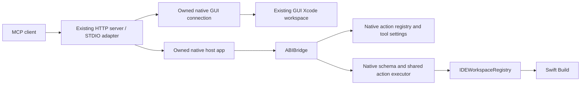

# Native Xcode MCP Host Design

## Objective and scope

XcodeMCPKit owns the MCP endpoint, a windowless native workspace host, and its
direct connection to an existing GUI Xcode. The target architecture launches
neither `mcpbridge` nor Xcode Service. It operates without a GUI workspace and
also uses an already-open Xcode workspace's actual state, including unsaved edits
and selected scheme. Agents select the project rather than manage screen state.

The installed Xcode supplies tool definitions and implementations. ABIBridge
loads and invokes them inside the owned host. XcodeMCPKit supplies process and
workspace lifetime, MCP transport, request context, and narrowly justified bug
corrections. Reimplementing individual build, test, preview, or editing tools
would undermine the required maintenance model.

Existing tool names, arguments, outputs, progress, native failures, and
cancellation remain the external contract. The native public catalog determines
which tools are exposed; registration alone does not make an internal action a
public MCP tool. Definitions must not become a checked-in list of tool names or
a separate set of hand-written schemas.

Preserve the current combined tool lineup by reading and combining the native
GUI and headless public selections. The prototype obtained 53 GUI tools and 54
headless tools, matching both recorded native catalogs by name; their union
contains 57 tools. Internal actions outside these public selections are not
included just because they were registered.

Window and current-editor tools describe actual GUI state when connected to an
existing Xcode workspace. Without a GUI workspace, they return that no window or
current editor exists. Workspace diagnostics do not require a navigator window.
GUI-only contracts must not be silently dropped or given fabricated success.

### Workspace access and automatic selection

`workspaceIdentifier` accepts a native identifier or absolute `.xcworkspace` /
`.xcodeproj` path. For ordinary workspace operations, an absolute path is enough:
agents need not call `XcodeOpenWorkspace` before the first read, edit, or build.
The common workspace resolver supplies this behavior to all scoped tools.

For a project path, resolve the execution owner in this order:

1. Find the GUI Xcode workspace already owning that path and execute there.
   Use its unsaved editor models, selected scheme/destination, debugger and
   native operation state. Resolving a tab is internal connection context.
2. If no GUI workspace owns the path, resolve an existing model in the owned
   host's native registry, or lazily open that model without creating a window.

This is one client-facing access mode. GUI presence does not require a client
flag or a change to the MCP tool catalog. If the same project is open in multiple
Xcode instances, expose those actual owners and request an unambiguous workspace
selection; the frontmost window is not a project identity.

Known GUI identifiers retain their GUI owner. An opaque identifier returned by
the owned host selects that host's model after matching the actual native
workspace inventory. This proof does not depend on
unrelated GUI connections. Absolute paths still require enough GUI ownership
information to choose the correct owner; unresolved ownership produces an error.
A selected GUI owner must itself provide the tool. Another provider's matching
name does not authorize replay against a different workspace model.

"No workspace open" means that agents need not open a workspace window or issue
an explicit Open call. Scoped build and project operations still require Xcode
to load the project model internally. Unscoped tools such as documentation
search and project-template discovery work without loading a project at all.

GUI disappearance or appearance can change the owner selected for new work.
An in-flight operation and a stateful session remain bound to the owner that
created them. Cancellation, debugger commands, device sessions and related logs
must not be redirected to a fresh model. A lost GUI owner produces an explicit
failure for its outstanding work; mutations with unknown delivery are not
retried against the owned host.

`XcodeOpenWorkspace` remains available for explicit preloading. Automatic loading
applies to operations that need a model, not to Close: Close must not open a
missing project merely to close it. Closing an owned model does not implicitly
close the user's GUI window. GUI workspace/window lifetime remains Xcode-owned.

## Target structure and ownership



Keep the existing package and public products. Add an internal native runtime
target and a host executable, packaged as an application bundle. They depend on
the ABIBridge version pinned in `Package.swift` and Foundation/AppKit, and must
not link the proxy's NIO runtime.
The host loads frameworks from the selected Xcode installation without copying
or redistributing Apple's frameworks.

Embedding the runtime in the server would share process-wide AppKit state,
native libraries, and termination handlers with NIO. A separate host provides
the required isolation and independent lifecycle. A new public library product
or separate package is unnecessary.

| Resource | Owner |
| --- | --- |
| HTTP sessions, STDIO adapter, MCP requests and client cancellation | Existing server runtime |
| Host executable, launch path and restart | Server process runtime |
| Xcode images, ABI handles and native values | Native runtime |
| Workspace inventory, identifiers and project models | `IDEWorkspaceRegistry` |
| GUI workspace/editor models, unsaved edits and UI selection | Existing GUI Xcode |
| Path-to-owner resolution and operation affinity | Server routing authority |
| Action streams and operation cancellation | Native runtime using Apple's executor |
| Per-request artifacts and injected context | Native runtime |
| Build engine | Native host and its Swift Build child |

Use one host per server and selected Xcode installation. Connections and
workspaces share it; client count must not create more hosts or build engines.
The initial build engine remains a child process. In-process Swift Build is a
separate decision because earlier experiments encountered duplicate Objective-C
classes in Apple's bundled libraries.

Workspace state remains with the selected owner: the native registry for owned
headless models, and GUI Xcode for its models. Routing records connection and
identity, not a second copy of project/editor state. Client disconnect does not
close a shared workspace. Close is explicit. Host restart invalidates its native
identifiers and must be surfaced; mutations with unknown delivery are not replayed.

### Direct GUI connection

Connect through the Xcode frameworks' native messaging boundary using ABIBridge
and an owned connection implementation. Binary inspection confirms the relevant
`IDEIntelligenceMessaging.BridgeConnection`, `BridgeToToolService` and
`ToolServiceToBridge` contracts used for list, call, progress, cancellation, and
session context. These are in the Xcode frameworks; running the `mcpbridge`
executable is not required to make them part of the implementation.

ABIBridge invokes the local messaging framework; the connection sends operations
to Xcode, where the live objects reside. It does not turn another process's
workspace pointers into local objects. Merely opening the same path in the owned
host would not preserve GUI unsaved edits or operation state.

The owned GUI connection uses a BoardServices listener and a RunningBoard
endpoint injection assertion. Xcode connects back to that listener. The host
initializes the native session with the MCP client's name and version, then
forwards native tool messages and progress. Connection handling stays inside
the native process; the NIO server does not load Xcode frameworks.

Xcode retains its native agent approval behavior. A disconnected owner ends
outstanding requests, and a mutation is not replayed in another process.
GUI builds use Xcode's selected scheme and save its edited documents before
building. Apple's `XcodeRead` and `XcodeGetCurrentFile` implementations read the
document's file URL from disk, including when the editor has an unsaved buffer;
the connection preserves those native reading semantics.

Automatic access requires Xcode's native permission store before either GUI or
headless initialization. Xcode 27 provides the verified contracts. Xcode 26.6
lacks them, so its earlier GUI messaging results below describe only the transport.

The native messaging contracts vary by installation. The inspected Xcode 26.6
provides a GUI catalog when a workspace is open, while its headless initializer
lacks a required contract. Its cold Welcome state can disconnect before catalog or
window discovery completes. The runtime reports that unavailable inventory
instead of treating it as proof that no GUI workspace exists.

Cancellation follows the actual messaging capability. Xcode 27 supports a native
cancel message. Xcode 26.6 cancellation is advisory once an action is dispatched;
the connection retains the action until its reply or disconnection. A queued
request can be cancelled before dispatch. Shutdown warns about dispatched
uncancellable actions still awaiting replies. Disconnecting their connection
does not prove that Xcode stopped them.

## Dynamic tool contracts and maintenance

For each catalog request, or a validated native catalog invalidation, the host:

1. Reads `DVTStatelessActionManager.allActionMetadata`.
2. Reads native GUI/headless MCP tool selections and combines their public names.
3. Obtains each selected action's `ToolSchema`, metadata, and actual conformance.
4. Converts schemas to MCP JSON Schema through one recursive converter.
5. Determines workspace scope from native input-type conformance and normalizes
   context arguments in the same way as Apple's provider.

The converter preserves descriptions, required properties, enums, objects,
arrays, and nested schemas. It handles schema forms, not tool names. Workspace
scope comes from the action's associated `Input` type and
`IDEWorkspaceStatefulActionInput` / `IDEWorkspaceStatefulActionInputV2`
conformance, not a name prefix or a manually maintained set.

The proxy retains native and GUI catalogs as separate provider records. A usable
GUI catalog can supply GUI operations after headless initialization or discovery
fails. That fallback does not satisfy headless requests and does not select
another developer directory. SDK support follows detected contracts rather than
a build-number allowlist.

When providers advertise the same name with different schemas, the public
descriptor preserves whole variants through `anyOf`. Each entry under tool
`_meta["com.lynnswap.xcode-mcpkit/providers"]` contains its origin and original
`descriptor`. The helper supplies installation and cancellation facts under
`_meta["com.lynnswap.xcode-mcpkit/origin"]` on initialization and catalog results.
Routing snapshots the chosen provider's definition with the operation lease;
normalization uses that snapshot even if another catalog refreshes during the call.

The 2026-10-03 prototype generated the 54 headless tools from native settings and
metadata without `mcpbridge`. All 54 input and output schema structures matched
the recorded pure-Xcode catalog after common context normalization. That included
nested property types, required fields, and enums; description wording was not
compared. Forty-five tools were identified as workspace scoped and nine as
unscoped. This validates the generic boundary, not future Xcode versions.

The additional three public GUI tools are dynamically discovered through the
native GUI selection. Their windowless-state behavior needs explicit validation;
preserving names alone does not establish GUI editor equivalence.

The host injects internal parameters such as `temporaryArtifactsPath` and
`conversationID`. Agents use `workspaceIdentifier` or an absolute path, which the
workspace resolver turns into a GUI owner or a lazily loaded native model before
invocation. Some native schemas mark
`tabIdentifier` as required although workspace invocation works; the common
context adapter removes that dependency in headless mode.

Execution uses `DVTStatelessAction.executeStream(inputJSON:)`. One ABI adapter
supplies concrete metadata and the actual conformance. JSON decoding, tool
behavior, output encoding, and native errors remain Apple's implementation.
The host retains images and values for the duration of the stream.

Progress and completion become standard MCP notifications and results.
Where the native contract supports cancellation, the host forwards cancellation
to the operation. An advisory cancellation retains ownership until native
completion; stopping event delivery does not establish that a mutation stopped.
Errors embedded in completed native values retain their native meaning. A
stream ending without a final result is not a successful empty response.

New tools and argument changes require no per-tool source edits when they use
the supported contracts. Changes to the registry, schema representation, scope
protocols, or executor ABI require changes at this shared boundary. Unknown
contracts are diagnosed explicitly; the host must not silently omit tools or
guess a private value layout. Re-resolve addresses from the selected installation
at runtime, rather than storing offsets or redistributing generated binary data.

## Native initialization and corrections

Use an AppKit event loop, `IDEApplication`, a retained document controller, and
prohibited activation policy. A proper app bundle is required for services such
as the notification center. Terminate through the native application lifecycle;
direct `exit()` triggers the unexpected-exit handler.

As requested, use `com.apple.dt.mcp-server` and the complete entitlement
dictionary extracted from the selected Xcode Service. The prototype launched
with all 52 entries and its signed dictionary matched the source. Launch the
owned executable by absolute path so the shared identifier does not select the
installed Service. Signing identity and effective access differ from dictionary
equality; Developer ID, notarization, and installation remain to be verified.

Add Xcode's preferences suite process-locally so installed documentation can be
located. Prepare the workspace breakpoint manager on the main thread before
debugger launch to avoid the `DVTGlobalCustomDataStore.defaultStore` assertion.
Preserve `com.apple.dt.previewsd.allowed`: the simulator's preview daemon rejected
the prototype without it. Rendering and snippets succeeded with it.

The confirmed crash-tool defect belongs in a narrow native correction. Apple's
`resolveCrashProductInfo(bundleId:platform:)` has a search path accepting the
first bundle-ID match with an App Store ID without checking product platform.
For tweetpd this selected the macOS product and its empty crash cache for an iOS
request. Changing product order made both tools succeed; restoring it made both
fail. A temporary cache reference reproduced that change in the unmodified
Service. Diagnostic changes and the reference were removed.

Select the product by bundle ID and requested platform. Do not permanently
reorder the global inventory or alter caches. A correction must preserve
unrelated operations, remain separate from the generic executor, and have a
removal condition when Xcode fixes the affected contract. It must not become a
second implementation of the crash-analysis tools.

Cached report retrieval does not verify online retrieval. Developer-account
and effective keychain access are separate cases: the earlier prototype
observed zero developer accounts despite copied entitlements. Authentication
cannot be declared equivalent from bundle ID or signing dictionary alone.

## Public API, reuse and removal

Retain `XcodeMCP`, `listTools()`, and `callTool(_:arguments:)`. They already use
dynamic names and JSON arguments, so new tools need no additional Swift wrappers.
Keep the existing HTTP endpoint, STDIO client adapter, server lifecycle, timeouts,
message limits, result artifacts, and client tool policy.

For embedding, propose one optional server configuration value,
`nativeHostBundleURL: URL?`, locating an application-owned helper. Installed
executables discover their helper through the installation layout. Select Xcode
through the configured developer directory; do not retain the prototype's
hard-coded installation paths. Intended use remains:

```swift
let server = XcodeMCPProxyServer()
let endpoint = try await server.start()
// Existing clients connect to endpoint, call listTools(), and invoke tool names
// and argument contracts returned by the native catalog.
try await server.shutdown()
```

Embedded applications use the same lifecycle with an explicit helper location.
Missing bundles and initialization errors produce concrete startup diagnostics.
Reuse existing `UpstreamSession` ownership and delivery where it fits the host.
Shared protocol code must not bring NIO into the Apple-framework process.

Remove default and fallback `mcpbridge` launch paths, Service availability checks
and bridge pools as the native paths become complete. Replace bridge-dependent
GUI routing with direct native connections while retaining useful path ownership
and operation-affinity behavior. GUI connection permissions remain part of the
native service contract; remove old dialog automation only when the replacement
permission flow is verified. There is no hidden `mcpbridge` fallback. Generic
user-supplied transports remain separate client capabilities.

Bridge-specific public configuration and CLI options require an explicit
migration decision, including any breaking release. Do not reinterpret a process
count as native-host duplication or retain ignored options indefinitely. Existing
public product names can remain.

## Standalone host

The native host can be built and used over STDIO independently of the proxy:

```sh
./scripts/build-native-host.sh --developer-dir /Applications/Xcode.app/Contents/Developer
.build/native/XcodeMCPNativeHost.app/Contents/MacOS/xcode-mcp-native-host
```

The script assembles and signs the application with the selected Xcode Service's
complete entitlement dictionary and the native GUI bridge's process entitlements.
Shared array values are combined. Launch the packaged executable; a bare SwiftPM
binary does not provide the required application bundle identity. Framework
diagnostics go to stderr and JSON-RPC responses go to stdout.

After MCP initialization, `tools/list` returns the installed Xcode's public
catalog. A `tools/call` request can pass an absolute project path through
`workspaceIdentifier`; the native registry loads it without a window. Each call
gets a separate artifacts directory in one conversation. Cancellation targets
the matching request and propagates through the native action stream. EOF
cancels outstanding requests and closes models owned by this host.

By default, the standalone host describes its own windowless state. Its window
list is empty, and current-editor operations return a native error when no editor
exists. To use the actual state of an existing Xcode process, start the helper
with `--gui-pid <PID>` and that Xcode application's `--developer-dir`:

```sh
.build/native/XcodeMCPNativeHost.app/Contents/MacOS/xcode-mcp-native-host \
  --gui-pid <PID> --developer-dir /Applications/Xcode.app/Contents/Developer
```

The GUI connection exposes that Xcode's public catalog. Scoped calls accept an
absolute path to a workspace already open in that process or its native tab ID.
The helper resolves the tab internally and forwards native MCP results, including
images and structured content. It does not load a second workspace model.
Integration into the existing proxy is the remaining phase of
[the backend migration](https://github.com/lynnswap/XcodeMCPKit/issues/251).

## Verification and migration

Implement the host, catalog, and common executor first. Verify all selected tool
schemas and that an added registered action needs no tool-name table change.
Validate descriptions separately from structural equality.

Connect the host to request ownership and existing transports. Verify native
cancellation, progress, disconnect, multiple workspaces, independent close,
failed initialization, normal shutdown, and restart. The serial diagnostic
harness is not production transport.

Verify a path-scoped operation with neither an explicit Open call nor a GUI
workspace. Then verify the same operation against a GUI-open disposable project,
including an unsaved edit and a different selected scheme. Open and close GUI
workspaces during native work to validate new-owner selection and existing
session affinity. Test multiple GUI instances with the same path and confirm
that no foreground-window heuristic silently chooses a target.

Complete the platform-aware product correction and cached/online report checks.
Use disposable fixtures for mutations and the authorized tweetpd app for
read-only Organizer queries. Confirm absence of workspace windows throughout.

Package the helper, selected-Xcode loading, signing, and install discovery.
Verify installed CLI use and an embedding consumer supplying its own helper.
Historical validation environments are not build-number allowlists.

When the replacement passes those checks, remove bridge routing and its tests
in the same migration, update setup documentation, run the repository's required
tests, and obtain Codex review. Temporary comparison paths are migration work,
not a permanent user-selectable backend.
